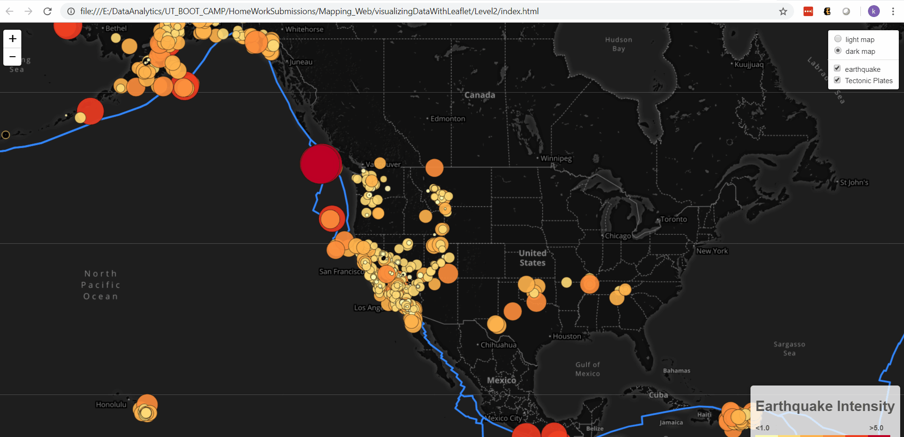

# Visualizing Data with Leaflet

This project is about using leaflet, to visualize the earthquake data set and show the location of tectonic plates. The earthquake dataset is read from USGS (United States Geological Survey) and tectonic plates information is obtained from <https://github.com/fraxen/tectonicplates>. 

Data from two different sources have to read for this js code. A tricky part of this code is to create a promise chain for fetching data in proper order to ensure that map is not created until all data is fetched.  

### Earthquake Layer
* Earthquakes are marked using circle data markers. The size of circle is proportional to the magnitude of the earthquake. In addition, a color scaling was also applied so that the earthquakes with higher magnitudes are represented by circles of darker color.
* Popups are included in the earthquake visualization, which provides additional information about the earthquake event.
* Legends are added in the map.

### Tectonic Plates Layer
* A second data set layer was added on the map to illustrate the relationship between tectonic plates and seismic activity.
* A "light" and "dark" base layers were added to the map.
* Layer control was added to the map.

